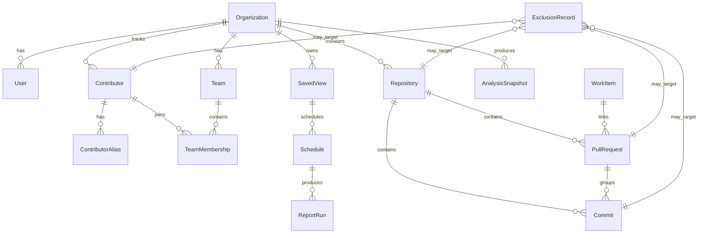

# Domain Model

This document defines the target business/domain model for the refactor.

## Entity map

## Core entities

### Organization

Purpose:

- top-level business boundary for scope, permissions, reporting, and norms.

Required capabilities:

- own teams, contributors, repositories, saved views, schedules;
- own organization-wide defaults and policies;
- support admin/data-health operations.

### User

Purpose:

- authentication, authorization, preferences, and action/audit actor identity.

Key rule:

- a user may observe analytics without being a tracked contributor.

### Contributor

Purpose:

- canonical tracked engineering identity for analytics.

Key fields:

- `id`
- `organizationId`
- `displayName`
- `primaryEmail`
- `classification` (`internal`, `external`, `bot`, `former_employee`)
- `isExcluded`
- `primaryTeamId` (nullable but strongly preferred)

Key invariants:

- one contributor can have many aliases;
- one contributor can have many team memberships over time;
- downstream rollups should reference contributor, not alias.

### ContributorAlias

Purpose:

- raw provider-specific identity record used in matching and ingestion.

Key fields:

- `providerType`
- `providerId`
- `email`
- `username`
- `confidence`
- `status` (`auto_merged`, `suggested`, `unresolved`, `manual`)

Key invariants:

- alias must map to at most one canonical contributor;
- unresolved aliases can exist before merge.

### Team

Purpose:

- primary management scope.

Key fields:

- `id`
- `organizationId`
- `name`
- `parentTeamId`
- `managerUserId` or `ownerUserId`
- `defaultNormProfileId`

Behavioral rules:

- team has auto-discovered repositories from contributor activity;
- team can pin or exclude repositories;
- team can be used as default scope in dashboards and schedules.

### TeamMembership

Purpose:

- time-bounded association between contributor and team.

Key fields:

- `teamId`
- `contributorId`
- `effectiveFrom`
- `effectiveTo`
- `isPrimary`
- `role`

Key invariants:

- point-in-time attribution must use effective dates;
- at a given time, contributor should have at most one primary team.

### Repository

Purpose:

- code container and drill-down surface.

Key fields:

- `provider`
- `owner`
- `name`
- `fullName`
- `defaultBranch`
- `connectionState`
- `isExcluded`
- `lastUpdatedAt`

Behavioral rules:

- repository can appear in many team scopes;
- repository is tracked independently of a single analysis run.

### WorkItem

Purpose:

- strategic intent container for delivery/allocation reporting.

Examples:

- Jira issue
- Linear issue
- Azure DevOps work item
- epic or initiative linkage

### PullRequest

Purpose:

- primary delivery/review object for management UX.

Key fields:

- `repositoryId`
- `authorContributorId`
- `state`
- `createdAt`
- `mergedAt`
- `mergeStrategy`
- `isDirectPushPseudoPr`

Key invariants:

- PR is primary surface for cycle/review metrics;
- PR may link to multiple work items;
- PR may contain multiple commits, including pre-squash history.

### Commit

Purpose:

- evidence and code-health unit.

Key fields:

- `repositoryId`
- `pullRequestId` (nullable)
- `authoredByContributorId`
- `committedByContributorId`
- `branch`
- `authoredAt`
- `committedAt`
- `diffStats`
- `isOnDefaultBranch`

Key invariants:

- commit remains queryable after squash if ingested before branch deletion;
- direct pushes may later be wrapped by pseudo-PR behavior for team reporting.

### SavedView

Purpose:

- saved scope/filter object reusable across dashboards and schedules.

Key fields:

- `name`
- `visibility`
- `scopeDefinition`
- `filterDefinition`
- `ownerUserId`

Key invariants:

- not restricted to a single team;
- must support multi-team and custom-repo scopes.

Slice 4 production note:

- until `Organization` exists in production, `SavedView` is implemented as workspace-scoped;
- `ownerUserId` remains required;
- visibility may be limited to `private` and `workspace` in Slice 4.

### Dashboard

Purpose:

- layout/configuration of widgets shown for a scope.

Key rule:

- a dashboard does not replace saved scope; it renders within a scope.

Slice 4 implementation note:

- the separate persisted `Dashboard` object is deferred;
- existing `/dashboard` becomes the scope-aware `Home` surface bound to `ActiveScope`.

### Schedule

Purpose:

- recurring delivery rule for a saved view or dashboard.

Key fields:

- `targetType`
- `targetId`
- `cadence`
- `deliveryChannel`
- `isActive`

### ReportRun

Purpose:

- generated delivery instance used for history, resend, and audit.

### AnalysisSnapshot

Purpose:

- internal processing/sync/freshness record.

Key rule:

- keep this away from primary UX;
- surface only derived freshness/health information.

### ExclusionRecord

Purpose:

- reversible exclusion or filtering metadata.

Targets:

- contributor
- repository
- pull request
- commit
- bot pattern
- branch pattern

### CurationAuditLog

Purpose:

- immutable record of curation actions and before/after state.

## Relationship rules

### Scope relationships

- Teams contain contributors through memberships.
- Teams do not own repositories permanently; repo association is partly discovered from activity.
- Saved views can combine teams, repositories, and contributors arbitrarily.

### Attribution relationships

- Work item is strategic intent.
- Pull request is delivery/review container.
- Commit is evidence container.

### Diagnostics relationships

- Analysis snapshots feed freshness and health indicators for repositories and teams;
- they should not be required to navigate analytics.

## Non-goals for the domain model

- No direct reuse of `Order` as a business term.
- No assumption that one contributor belongs to exactly one team forever.
- No assumption that one repository maps to exactly one team.
